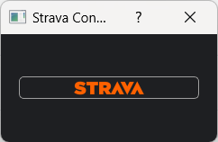
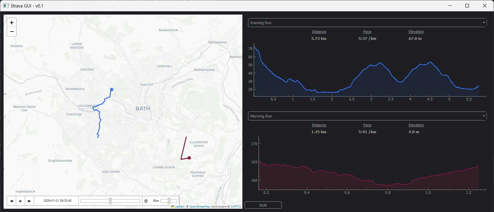

# Strava Activity Animation
*Author: Kieran Gash*\
*Github:*\
*Release Version: v1.0.0*\
*OS: Windows*

This project enables users to access activities stored on Strava by utilising the Strava API.

The users can visually compare two selected activities irrespective of the time the activity was performed or the
location of the activities. When the application is executed, the map centralises around the activities, and they are 
simultaneously plotted on the map creating an animation of the activity. 

Supporting graphics include the elevation profile and activity details such as
distance, pace and total elevation.

The animation speed can be modified, restarted or the user may change which activities to compare. Authentication is
only required when initially opening the application or if wanting to access a different Strava profile (although this
functionality is not yet added)

This application is a work in progress and continued updates will be released resolving bugs and adding additional
functionality. Currently desired functionality to improve/add can be found at the bottom of this README document. 

## Application Screenshots
**Logon/Connection dialog:**\

**Main window:**\

## Installation
Currently, this project has not been created into a package. Therefore, cloning the github repository is the best method
for accessing all the required source code and executables.

## Running the Application
1. Locate and open the executable:\
`"C: ...\strava-api\dist\strava_gui\strava_gui.exe"`
2. Select the Strava button on the application connection dialog. 
3. Log in to Strava using personal credentials. 
4. Navigate back to the connection dialog and wait for loading to finish (approx. 10sec)
5. Select activity 1 from the top drop down. 
6. Select activity 2 from the bottom drop down.
7. Select Run button to load the animation. 
8. Select play button on the map to begin playing the animation. 

## Features
***Strava Authentication Management***\
Authentication is managed using strava_authoristation.py script. The script utilises requests and urllib.parse to store
authentication codes, refresh tokens and access tokens so that the user can seamlessly use the application. A
walkthrough guide is shown at the end of this README file. 

***Strava Dataset Manipulation***\
As part of the strava_dataset.py script, the users activities, activity data and GPS route stream information is
extracted using access tokens and passed the graphical interface.

***Time Stamped GeoJson Creation***\
The mapping and animation feature requires a timestamped geojson to created. This can be located within the
helper_functions.py script. The format is created using the activity dataframe as outputted by the Strava Dataset
manipulation. 

***Custom Stylesheet***\
Stylesheet being used is entirely customised and stored within strava_stylesheet.qss. This utilises the orange colour
theme as part of the Strava branding. 

***Activity Animation***\
Within the main GUI code, the animation is created using TimeStampedGeoJson feature of the Folium library. The created
geojson is passed into this function and the map is updated continuously by plotting each geojson data point one after
the other and leave the route trail behind. 

## Dependencies
* Users must have access to a Strava account with activities utilising GPS data. \
`https://www.strava.com/`
* For executable user must be using a Windows PC. MAC OS is not supported!
* If running source code a Python environment with the following packages are required:
  * PyQt5 - Graphical UI design
  * folium - Map design
  * numpy - Array computation
  * pyqtgraph - Scientific graphics
  * pyqtspinner - Loading spinner
  * requests - http interaction

## Bugs and Improvements
- [ ] Improve the css "how to edit the default leaflet.timedimension_css when used in a python script"
- [ ] Compare activities between multiple athletes
- [ ] Add option to filter Runs and Rides on setup screen
- [ ] Add map home location option on setup screen
- [ ] Add Logout or change user option on main window.
- [ ] Review map selection, try to get exact Strava map - mapbox?

## Release History
* v1.0.0 - Initial Release of executable

## Strava Authentication Walkthrough

1) Get Client ID and Client Secret from Strava application webpage:
https://www.strava.com/settings/api

2) Paste the URL below into a browser and replace "your_client_id" with the Client ID obtained from step 1:
https://www.strava.com/oauth/authorize?client_id=your_client_id&redirect_uri=http://localhost&response_type=code&scope=activity:read_all

3) Redirect webpage shall contain the following URL. Save the code which will be in place of the "somecode" in the URL provided:
http://localhost/?state=&code=somecode&scope=read,activity:read_all

4) Make a POST request to the following URL. Replace with the Client ID, Client Secret and Code:
https://www.strava.com/oauth/token?client_id=your_client_id&client_secret=your_client_secret&code=your_code_from_previous_step&grant_type=authorization_code

5) Save the refersh token and access token from the output. 

6) Use the refresh token to obtain an updated access token:
https://www.strava.com/oauth/token?client_id=your_client_id&client_secret=your_client_secret&refresh_token=your_refresh_token_from_previous_step&grant_type=refresh_token 